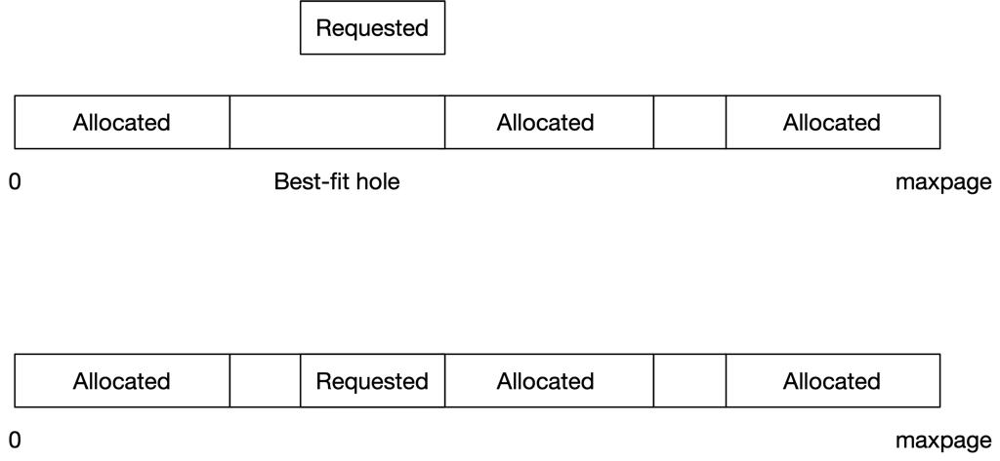

# Implementing Memory Allocation Policies in MINIX

The first fit (essentially next fit) algorithm is the default algorithm in MINIX. This essentially finds the next hole large enough to accomodate the size requested, starting from the current position and then returns that hole.

This is then tweaked to implement the Last Fit algorithm which works like first fit but starts from the end of the list. 

The next algorithm implemented is the Best Fit algorithm which works as follows :
1. The memory is scanned first to get the list of all the holes present. These holes are stored in an array, named 'holemap'.
2. To allocate the memory, this array is first traversed fully and the hole that best fits the memory required is recorded. If the hole is bigger than the requested memory, only the requested memory is allocated, not the entire hole.

A system call to supplement the above is implemented as follows :
1. The system call VM_PRINT_HOLES prints all the holes that exist in memory.
2. It first calls the print_holes() function in alloc.c. This function then calls the get_all_holes() function which updates the holemap array.
3. This array is then traversed by the function and it filters out holes less than a minimum size and prints all the other ones.

